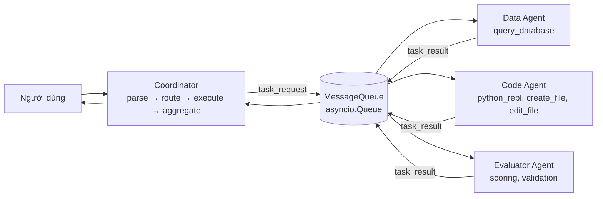

# Báo cáo RQ2: Multi-Agent System (Ngày 5, Day 20, Track 3)

Báo cáo này nằm ở `report/RQ2_REPORT.md`. Báo cáo của bài Deep Agents vẫn ở `report/REPORT.md`.

## 1. Tổng quan bài lab

Hệ thống multi-agent xử lý yêu cầu của người dùng qua một Coordinator, ba worker chuyên biệt và bốn nhóm tool.

- **Coordinator:** nhận yêu cầu, phân loại (bằng từ khóa, không gọi mô hình), định tuyến đến worker, chờ kết quả có timeout và retry, rồi tổng hợp.
- **Data Agent:** viết một truy vấn SQL chỉ đọc, chạy truy vấn, và tóm tắt kết quả.
- **Code Agent:** viết script Python, chạy trong sandbox, sửa tối đa hai lần nếu lỗi, và tạo biểu đồ.
- **Evaluator Agent:** chấm kết quả của Data/Code theo bốn tiêu chí (trọng số 30/30/20/20).

Mục tiêu: hệ thống ổn định, hiệu quả, và có thể mở rộng.

Lưu ý về phạm vi: báo cáo này dựa trên các mục của hướng dẫn mà tôi đọc được. Trang "Phần 1" (câu hỏi tổng quan) không hiển thị đầy đủ, nên mục 1–2 trả lời theo thiết kế đã triển khai, không theo đề có sẵn.

## 2. Kiến trúc

**Giao thức.** Coordinator gửi `task_request` có `task_id`, `content`, `parameters`. Worker trả `task_result` có cùng `task_id`, `status` (`success`/`error`), `result`. Mỗi tin nhắn có `from`, `to`, `timestamp`, `id`, và được ghi vào `logs/communication.log`.

**Luồng hai giai đoạn.** Data và Code chạy trước và song song. Evaluator chạy sau và nhận kết quả của hai worker kia trong prompt.

**Quyết định thiết kế (trade-off):**
- Phân loại bằng từ khóa thay vì LLM: nhanh, không tốn token, nhưng yêu cầu diễn đạt khác có thể bị phân loại sai.
- Message queue trong bộ nhớ (`asyncio.Queue`): đơn giản, không bền vững, chỉ chạy trong một tiến trình.
- REPL chạy trong tiến trình con có timeout (thay cho luồng): dừng được vòng lặp vô hạn, nhưng khởi động chậm hơn (~1–2 s mỗi lần).
- Truy vấn SQL: kiểm tra đầu vào + kết nối SQLite chỉ đọc (`mode=ro`) + chặn từ khóa ghi.
- Timeout worker 60 giây, tối đa 2 lần thử lại (ghi trong code). Hướng dẫn ghi 30 giây và 3 lần thử lại; tôi chọn giá trị trong code mẫu vì worker LLM thường chậm hơn 30 giây.

## 3. Triển khai

| Thành phần | File | Ghi chú |
|---|---|---|
| Coordinator | `src/coordinator.py` | parse, route, execute (song song, timeout riêng), retry chỉ tác vụ lỗi, aggregate (`success`/`partial`/`error`) |
| Worker chung | `src/agents/base_worker.py` | `process`, `process_async` (chạy trong thread), `serve` (vòng lặp queue) |
| Worker chuyên biệt | `src/agents/{data,code,evaluator}_agent.py` | mỗi worker có `system_prompt` và danh sách tool riêng |
| Message queue | `src/communication/message_queue.py`, `worker_proxy.py` | `QueueWorkerProxy` để coordinator gọi worker qua queue |
| Tool | `src/tools/*.py` | `query_database`, `python_repl`, `create_file`, `edit_file`, `scoring`, `validation` |
| Hệ thống | `src/system.py` | `MultiAgentSystem`: nối các thành phần, đếm token |
| Dữ liệu | `src/sample_data.py`, `data/sales.db` | 200 đơn hàng ngẫu nhiên, seed cố định (không phải dữ liệu thật) |

**Các lỗi đã gặp và sửa** (để tái lập và giải thích kết quả):
1. Worker không gửi `system_prompt`/định dạng cho mô hình → Evaluator trả JSON sai cấu trúc. Đã sửa: đưa prompt vai trò vào mọi lần gọi.
2. Bộ kiểm tra SQL chặn `WITH ... SELECT`. Đã cho phép (chỉ đọc).
3. Lỗi kiểm tra đầu vào (`ValueError`) thoát thẳng ra ngoài và bỏ qua vòng sửa. Đã sửa: coi là lỗi để thử lại.
4. Code Agent viết `sqlite3.connect(DB_URI)` thiếu `uri=True` → "no such table". Đã sửa: hàm `connect_db()` có sẵn trong sandbox.
5. Code Agent đoán tên cột (`quarter`, `date`) → không có lược đồ trong prompt. Đã sửa: đưa `SCHEMA` vào prompt.

Các lỗi này đều thấy trong log của lần chạy benchmark (xem `benchmarks/before_fix.json`, `benchmarks/fix1/`, `benchmarks/fix2/`, `benchmarks/fix3/`).

## 4. Kết quả test

Lệnh: `pytest -q` (toàn bộ, gồm cả bài Deep Agents): **96 test, tất cả đạt.**

| Tệp | Nội dung | Số test |
|---|---|---|
| `tests/test_02_coordinator.py` | Coordinator: parse, route, timeout, retry, partial, input lỗi, giới hạn số tác vụ | 14 |
| `tests/test_03_workers.py` | Worker, MessageQueue, coordinator ↔ worker qua queue, evaluator giai đoạn hai | 10 |
| `tests/test_04_tools.py` | Tool: SQL injection, chỉ đọc, REPL (import, timeout, lỗi), đường dẫn, chấm điểm, end-to-end | 27 |
| `tests/test_05_integration.py` | End-to-end, lỗi (SQL injection, sandbox, timeout, worker lỗi), 10 yêu cầu đồng thời, độ trễ offline, log queue | 11 |

Ngoài ra, `scripts/test_coordinator_standalone.py` đạt 3/3 và `scripts/test_tool_integration.py` đạt 3/3.

Test dùng mô hình giả (`FakeLLM`) nên không tốn token. Test của tool và REPL dùng SQLite và matplotlib thật.

## 5. Hiệu năng

Benchmark thật dùng `gpt-4o-mini`, ba tình huống, mỗi tình huống 3 lần, gửi tuần tự (`scripts/benchmark.py`). Ba lần chạy độc lập sau khi sửa xong (`benchmarks/run1.json`, `run2.json`, `run3.json`):

| Chỉ số | Mục tiêu | Lần 1 | Lần 2 | Lần 3 | Nhận xét |
|---|---|---|---|---|---|
| Độ trễ P50 | < 5 s | 7.83 s | 6.76 s | 8.38 s | Không đạt |
| Độ trễ P99 | < 15 s | 47.7 s | 58.8 s | 48.8 s | Không đạt |
| Thông lượng | > 10 yêu cầu/phút | 4.1 | 3.5 | 3.6 | Không đạt (gửi tuần tự) |
| Tỉ lệ lỗi | < 1% | 0% | 22% | 0% | Đạt 2/3 lần |
| Token mỗi 100 yêu cầu | ~150k | 241k | 284k | 276k | Không đạt |
| Độ bận Code Agent | 70–90% | 88% | 92% | 89% | Đạt |
| Độ bận Data / Evaluator | — | 18% / 6% | 16% / 4% | 17% / 6% | Thấp |

Độ trễ theo tình huống (trung bình của 3 lần chạy): truy vấn đơn ~2.3 s; sinh code ~7–14 s; tình huống phức tạp ~27–42 s.

**Nút thắt.** Tình huống phức tạp chậm vì chạy tuần tự nhiều bước: Data (dữ liệu) và Code (biểu đồ), rồi Evaluator (chấm điểm). Code Agent chiếm gần hết thời gian xử lý do có thể phải sửa script (tối đa 3 lần gọi mô hình và REPL). Thời gian chờ mô hình chiếm phần lớn thời gian. Profile mô hình giả (`logs/profile_fake.txt`) cho thấy chi phí của chính hệ thống chỉ vài chục mili-giây, còn lại là chờ I/O.

**Tài nguyên.** Token trung bình khoảng 2.400–2.800 token mỗi yêu cầu. Ở mức này, 100 yêu cầu khoảng 240–280k token, cao hơn mục tiêu 150k vì Code Agent có thể gọi mô hình tới 3 lần.

## 6. Xử lý lỗi và khả năng phục hồi

| Loại lỗi | Phát hiện | Xử lý | Test |
|---|---|---|---|
| Worker quá lâu | `asyncio.wait_for` (timeout 60 s) | Trả `status=timeout`, tiếp tục với kết quả còn lại | `test_slow_worker_times_out_gracefully` |
| Worker lỗi (exception) | Bắt trong `process_async` | Thử lại tối đa 2 lần, rồi trả lỗi | `test_worker_failure_does_not_stop_later_requests` |
| SQL nguy hiểm | Kiểm tra đầu vào + chỉ đọc | Chặn, thử lại có kèm lý do | `test_sql_injection_is_blocked_and_database_untouched` |
| Import nguy hiểm trong REPL | Allowlist + tiến trình con | Chặn, coi là lỗi để sửa | `test_python_sandbox_blocks_os_access_end_to_end` |
| Đường dẫn thoát khỏi thư mục | Kiểm tra `..`, tuyệt đối, ký tự | Chặn | `test_create_file_blocks_path_escape` |
| Nhiều yêu cầu cùng lúc | `asyncio.gather` | Mỗi yêu cầu có timeout riêng | `test_ten_concurrent_requests_meet_success_target` |
| Quá nhiều tác vụ | Giới hạn `MAX_TASKS = 5` | Trả lỗi ngay | `test_resource_limit_rejects_too_many_tasks` |

Lỗi được phát hiện và cô lập tốt. Thiếu: không có circuit breaker (một worker lỗi liên tục vẫn bị gọi lại), và không có cơ chế dự phòng (worker thay thế).

## 7. So sánh thiết kế dự kiến và thực tế

| Khía cạnh | Dự kiến | Thực tế | Nhận xét |
|---|---|---|---|
| Độ trễ P50 | < 5 s | ~7 s | Chưa đạt. Tình huống đơn giản đạt, tình huống phức tạp thì không |
| Thông lượng | > 10 yêu cầu/phút | ~4 yêu cầu/phút | Chưa đạt. Benchmark gửi tuần tự |
| Tỉ lệ lỗi | < 1% | 0–22% | Đạt 2/3 lần. Lần 2 có 2 yêu cầu phức tạp `partial` |
| Độ phủ test | — | 96 test đạt | Test dùng mô hình giả, chưa kiểm chứng chất lượng câu trả lời thật |

**Điều đã tốt:** phân tách rõ giữa coordinator, worker và tool; giao tiếp qua queue giúp ghi log từng bước; an toàn đầu vào của SQL và REPL.

**Điều khó:** prompt cho mô hình nhỏ cần rất cụ thể (tên cột, quy tắc import, định dạng JSON); mỗi lỗi thực tế đều đòi hỏi một lần sửa prompt hoặc code.

## 8. Khả năng mở rộng

- **Nhiều worker:** thêm worker chỉ cần một `serve()` và một proxy, nhưng queue hiện tại chỉ chạy trong một tiến trình.
- **Nhiều request:** coordinator xử lý đồng thời, nhưng mỗi worker xử lý tuần tự (một tin nhắn một lúc). Với nhiều yêu cầu, Data và Code sẽ thành nút thắt.
- **Dữ liệu lớn:** `query_database` giới hạn 1000 dòng và trả về tối đa 20 dòng cho mô hình. Dữ liệu lớn cần phân trang hoặc tóm tắt ở phía SQL.
- **Điểm chịu lỗi duy nhất:** Coordinator và queue trong bộ nhớ. Muốn scale ra nhiều máy cần message broker bền vững (ví dụ Redis) và nhiều coordinator.

Kiến trúc tách lớp tốt, nhưng queue và sandbox chưa phân tán.

## 9. Hạn chế

1. **Sandbox REPL không phải cách ly ở mức hệ điều hành.** Tiến trình con vẫn có mạng và truy cập hệ tệp (chỉ bị chặn bằng allowlist). Cần container để chạy an toàn trong môi trường thật.
2. **Phân loại bằng từ khóa** dễ sai với câu diễn đạt khác.
3. **Queue trong bộ nhớ**, không bền: nếu tiến trình dừng, tin nhắn và kết quả bị mất.
4. **Mẫu nhỏ và mô hình duy nhất:** 3 lần chạy benchmark, 3 tình huống, một mô hình. Độ trễ có phương sai lớn (P99 ~50 s).
5. **Đánh giá chất lượng câu trả lời chưa được kiểm chứng đầy đủ:** Evaluator là một LLM tự chấm, không có tập đáp án chuẩn.
6. **Thời gian chờ và số lần thử lại** được đặt trong code (60 giây, 2 lần), không phải cấu hình theo từng loại tác vụ.

## 10. Kết luận và đề xuất

Hệ thống chạy được end-to-end với mô hình thật: tình huống đơn giản đạt độ trễ ~2 giây, tình huống có sinh code đạt 7–14 giây, và tỉ lệ lỗi về 0% trong 2 trên 3 lần chạy. Hệ thống chưa đạt các mục tiêu về P50 (dưới 5 giây), thông lượng (trên 10 yêu cầu/phút), và token (khoảng 150k mỗi 100 yêu cầu).

**Đề xuất tiếp theo:**
1. Chạy các worker song song khi không phụ thuộc nhau (Data và Code đã song song; cần tối ưu bước sửa code).
2. Giảm số lần sửa code: cung cấp ví dụ mẫu đúng trong prompt, hoặc cache kết quả truy vấn.
3. Đưa REPL vào container để có cách ly thật.

## Phụ lục

- **Lệnh đã chạy:** `pytest -q`; `python scripts/test_coordinator_standalone.py`; `python scripts/test_tool_integration.py`; `python scripts/setup_data.py`; `python scripts/benchmark.py --iterations 3 --out benchmarks/runN.json` (N = 1..3); `python scripts/profile_system.py` (mô hình giả); `python scripts/debug_agent.py ...`; `python scripts/debug_system.py ...`.
- **Thử thách mở rộng (+5), hướng 6c - cache kết quả:**
  - Thiết kế: `src/caching.py` (cache kết quả `success`, chuẩn hóa chữ hoa và khoảng trắng). Thí nghiệm riêng trong `experiments/caching/`: cùng bộ 3 tình huống × 3 lần lặp với benchmark gốc, cache bật, ba lần chạy độc lập. Kết quả không cache lấy từ `benchmarks/run1–3.json`.
  - Kết quả: mỗi tình huống, lần đầu là miss (gọi worker), hai lần sau là hit (độ trễ ~0, 0 token). Tỉ lệ hit 67%.

    | Chỉ số | Không cache (3 lần) | Có cache (3 lần) | Thay đổi |
    |---|---|---|---|
    | Token mỗi lần chạy 9 yêu cầu | 21.669 / 25.594 / 24.872 (TB 24.045) | 6.767 / 4.167 / 5.329 (TB 5.421) | −77,5% |
    | Độ trễ trung bình mỗi yêu cầu | 14,6 / 17,4 / 16,9 s (TB 16,3 s) | 5,4 / 3,3 / 4,1 s (TB 4,3 s) | −73,9% |
    | Tỉ lệ lỗi | 0–22% | 0% | — |

  - Hạn chế: tỉ lệ hit 67% do thiết kế benchmark lặp lại đúng một yêu cầu ba lần, không phản ánh lưu lượng thật. Không có thời gian hết hạn: dữ liệu thay đổi thì cache trả kết quả cũ. Hai yêu cầu khác cách diễn đạt sẽ không trúng cache. Con số tiết kiệm sẽ thấp hơn nhiều với lưu lượng có ít lặp lại.
  - Đánh giá điểm (ước tính, không chính thức): không có thang điểm cho RQ2 trong tài liệu. Các mục checklist đã hoàn thành khoảng 85–90%. Chưa làm: push GitHub, nộp bài, trả lời 3 câu hỏi Phần 1 (không đọc được trong tài liệu). Bài Deep Agents (`RUBRIC.md`) ước tính khoảng 90–95/100, chưa tính điểm thưởng.
- **Ghi chú:** Các lần chạy benchmark trước khi sửa được giữ trong `benchmarks/before_fix.json` và `benchmarks/fix1/`–`fix3/`. Log từng agent nằm trong `logs/`.
